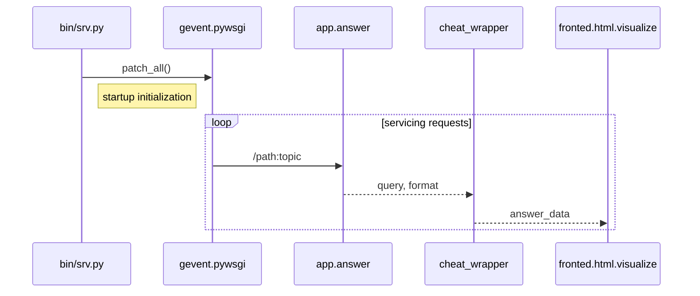

*cheat.sh* consists of server with cheat sheets, and *cht.sh* cli script that
fetches results from http server using `curl`. The default server https://cht.sh
also fetches and caches answers from StackOverflow.

There are two cases, when you want to install *cheat.sh* server locally:

1. You plan to use it off-line, without Internet access;
2. You want to use your own cheat sheets (additionally, or as a replacement).

## How to install cheat.sh server

To use cheat.sh offline, you need to:

1. Install local script,
2. Fetch its data sources.

If you already have the cht.sh cli client locally,
you can use it for the standalone installation.
Otherwise it must be installed first.

```
    curl https://cht.sh/:cht.sh > ~/bin/cht.sh
    chmod +x ~/bin/cht.sh
```

Now you can install cheat.sh server locally:

```
    cht.sh --standalone-install
```

By default `~/.cheat.sh` is used as the installation
directory, which will also contain config and data
sources.


If you don't plan to use Redis for caching,
switch the caching off in the config file:

```
    $ vim ~/.cheat.sh/etc/config.yaml
    cache:
      type:   none
```

or with the environment variable `CHEATSH_CACHE_TYPE=none`.

## Update cheat sheets

Cheat sheets are fetched and installed to `~/.cheat.sh/upstream`.
To keep the cheat sheets up to date,
run the `cheat.sh` `update-all` command on regular basis.
Ideally, add it to *cron*:

```
0 5 0 0 0 $HOME/.cheat.sh/ve/bin/python $HOME/.cheat.sh/lib/fetch.py update-all
```

In this example, all information sources will be updated
each day at 5:00 local time, on regular basis.

## Running cheat.sh server

Your local cheat.sh installation is full-fledged, and it can
handle incoming HTTP/HTTPS queries.

To start cheat.sh in the server mode, run:

```
$HOME/.cheat.sh/ve/bin/python $HOME/.cheat.sh/bin/srv.py
```

You can also use `gunicorn` to start the cheat.sh server.

### Request processing

For development you might be you're interested to know how
the request processing works,



## Docker

`cheat.sh` can also be deployed as a docker container.
Use `Dockerfile` in the source root directory, to build the Docker image:

```
docker build .
```

## Limitations

Some cheat sheets not available in the offline mode
for the moment. The reason for that is that to process some queries,
cheat.sh needs to access the Internet itself, because it does not have
the necessary data locally. We are working on that how to overcome
this limitation, but for the moment it still exists.

## Mac OS X Notes

### Installing Redis

To install Redis on Mac OS X (using `brew`):

```
$ brew install redis
$ ln -sfv /usr/local/opt/redis/*.plist ~/Library/LaunchAgents
$ launchctl load ~/Library/LaunchAgents/homebrew.mxcl.redis.plist
$ redis-cli ping
PONG
```
